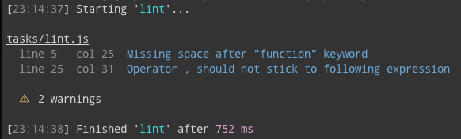

# gulp-jscs-stylish

Stylish reporter for [gulp-jscs](https://github.com/jscs-dev/gulp-jscs), uses [jshint-stylish](https://github.com/sindresorhus/jshint-stylish) to do the actual reporting.



## Install

```sh
$ npm i --save-dev gulp-jscs-stylish
```


## Usage

```js
var stylish = require('gulp-jscs-stylish');
var noop = function () {};

gulp.task('default', function () {
	gulp.src([ 'file.js' ])
		.pipe(jscs())
		.on('error', noop)
		.pipe(jscsStylish());
});
```


## License

MIT © [Christoph Werner](http://twitter.com/gonsfx)
